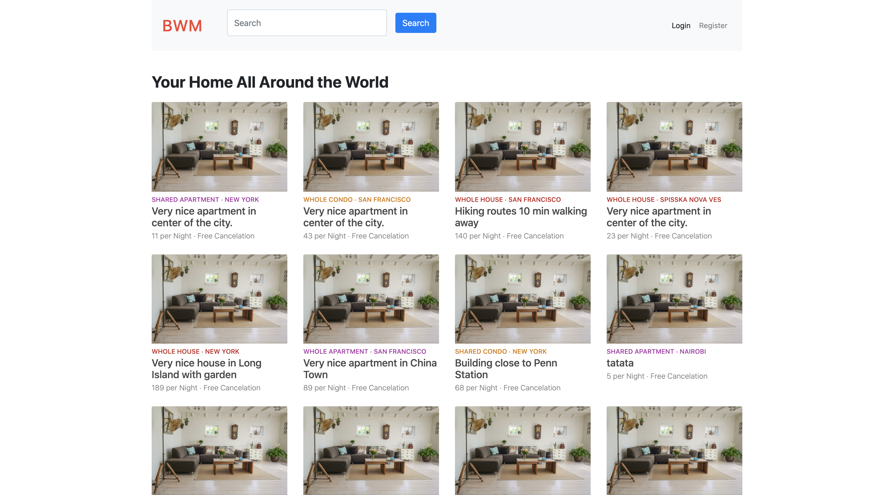

### _Landing page_



# BookWiseMarket Application
BookWiseMarket: A digital marketplace that empowers users to lease their properties or spare rooms to guests. Our platform is built using Angular and Node, offering a seamless experience for both hosts and guests.

Users can effortlessly browse and explore available properties, and when they find the perfect match, they can request a booking.

For property owners, managing their listings and bookings is a breeze. They have full control over their listings, allowing them to add, edit, and manage their properties, as well as handle booking requests with ease.

Join BookWiseMarket today to unlock the potential of your property and find the ideal space for your next adventure.


## Usage

| Normal User                                   | Property Owner                   |
| --------------------------------------------- | -------------------------------- |
| - Create an account and login                 | - Create an account and login    |
| - Search for a booking                        | - Create a property              |
| - Make a booking                              | - Manage the property(s)         |
| - Manage booking(s)                           |                                  |
|                                               |                                  |
|                                               |                                  |


##  Installation

### Prerequisites

- [Node 8^](https://nodejs.org/en/)
- [Angular 2+](https://angular.io/)

_Download the project to your local computer through_

- Download a zip folder of this repository
- Unzip it and navigate into the bookwithme directory
- To Install all required dependancies
```
Run npm install
```
- To start the server:
```
1. Run cd server.
   - This will navigate you to the server folder(cd/server)
2. Run nodemon index.js
   - This will start the server 
```

### Alternatively

_Run the following command_

```
$ git clone git@github.com:joelmachango/bookwithme.git
```
- To Install all required dependancies
```
Run npm install
```
- To start the server:
```
1. Run cd server.
   - This will navigate you to the server folder(cd/server)
2. Run nodemon index.js
   - This will start the server 
```

## Starting the Angular App
- To start the anglar app you need to be in the root directory 
```
Run npm start
```
This will run ng serve --proxy-config proxy.conf.json to start the angular app


## APIs

### Endpoints

| METHOD | ENDPOINT                                      | DESCRIPTION                      |
| ------ | --------------------------------------------- | -------------------------------- |
| GET    | /api/v1/rentals                               | Fetch all the rentals created    |
| GET    | /api/v1/rentals/<string:rental_id>            | Fetch a single rental            |
| POST   | /api/v1/users/register                        | Handle user registration         |
| POST   | /api/v1/users/auth                            | Login a Registered user          |
| POST   | /api/v1/rentals/                              | Create rental                    |
| PUT    | /api/v1/rental/<string:rental_id>/            | Update a specific rental         |
| DELETE | /api/v1/rental/<string:rental_id>/            | Delete a specific rental         |
| GET    | /api/v1/rental/<string:CityName>/             | Search for rental by city name   |
| GET    | /api/v1/bookings/manage                       | List all bookings made by a user |
| GET    | /api/v1/rentals/manage                        | All propeties listed by a use    |


## Technologies & Languages

**Project management (Agile)** [https://www.pivotaltracker.com](url)

**Version control (Git)** [https://git-scm.com/](url)

**HTML5**

**SCSS**

**Bootstrap**

**Typescript**

**Angular**

**NodeJs**


## Contributing

1.  Fork the repository

2.  Clone the repository to your local computer

```
$ git clone git@github.com:joelmachango/bookwithme.git
```
- To Install all required dependancies
```
Run npm install
```
- To start the server:
```
1. Run cd server.
   - This will navigate you to the server folder(cd/server)
2. Run nodemon index.js
   - This will start the server 
```


## License

MIT


